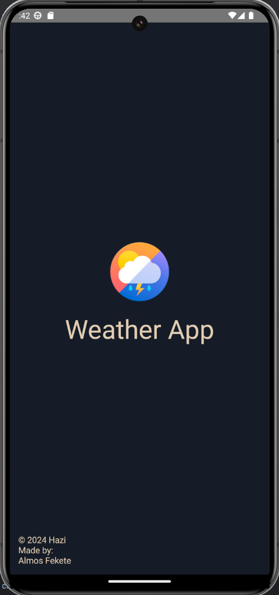
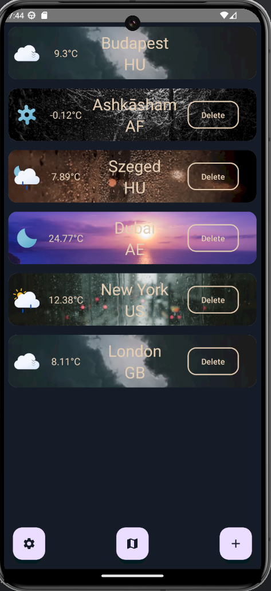
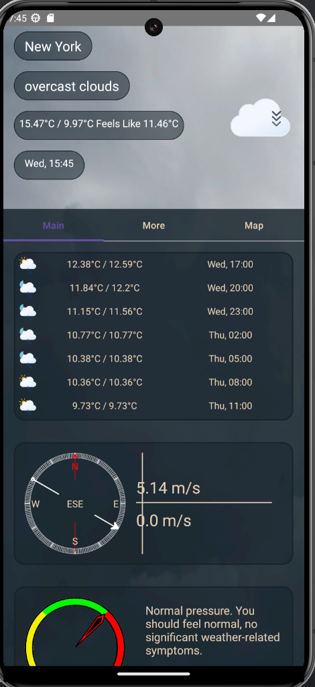
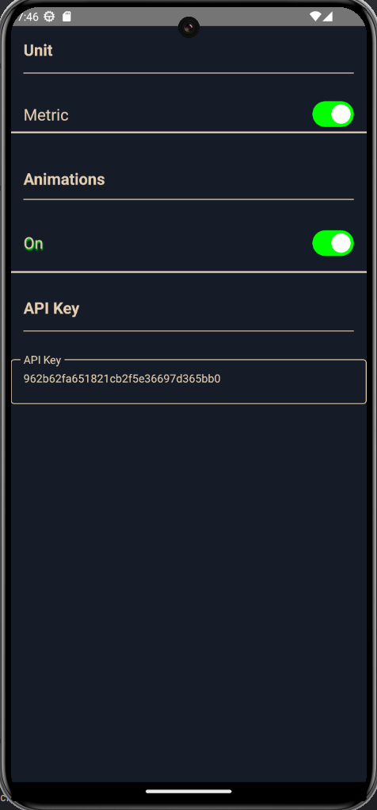
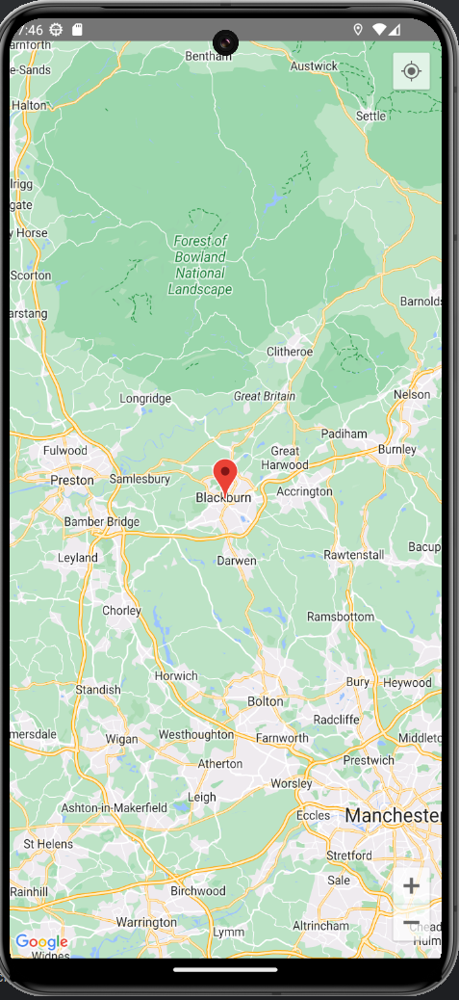

# Házi feladat specifikáció

## Android
### 2024 április 09.
### Időjárás APP
### Fekete Álmos

## Bemutatás

Weather (Időjárás) alkalmazást tervezek készíteni, körülbelül 3-4 hete elkezdtem írni. Az ötlet úgy jött, hogy már korábban dolgoztam az openweathermap API-val, Discord boton időjárás előrejelzés funkción. Az alkalmazás kibővítésre kerülhet, egy előrejelzéssel, hogyha később nem lép fel hiba, a túl sok API hívás miatt. Kerül bele saját kép, háttérkép. (Ez utóbbi, csak akkor, hogyha tudok hozzá szerezni megfelelő méretű háttérképet, ami minden felbontáson megfelelően nézne ki.) Kerül bele animáció is, hogy jobban nézzen ki az alkalmazás.

## Főbb funkciók

Az alkalmazás egyelőre Internet, (és helymeghatározást használ), ezek az engedélyek implementálva is vannak. Használ adatbázist, az elmentett városok, és helyszínek tárolására, illetve (GPS-helymeghatározást) is. Ezen felül a legfontosabb az az API hívás amihez szükséges az internet kapcsolat, szóval házózatot is használ. Animációkkal vannak ellátva az egyes UI elemek. Lehetőség van adatokat tárolni, illetve felvenni.

## Választott technológiák:

- Compose UI
- MVVM architektúra
- Dependency Injection (ViewModelFactory)
- UI (Jetpack Compose + MVVM)
- Animations
- LazyColumn
- ViewPager
- Perzisztens adattárolás (Adatbázis)
- (GPS hely alapú helymeghatározás)(Azért van zárójelben, mert leteszteltem és nem működik a legjobban Fake GPS app alapján. A városnév nem feltétlen található meg az openweathermap.org oldalán, így az API hívás nem lenne sikeres, illetve buggos valamiért a GPS emulátor és olyan vérosokat mint például: London, vagy valami kínai város, nem jelenít meg, vagy olyan formában jeleníti meg amire az openweathermap.org nem hoz találatot.)
- Hálózati kommunikáció (API kezelés, és hívás)


# Házi feladat dokumentáció (ha nincs, ez a fejezet törölhető)
A házi feladatban nagyon sok osztály, illetve layout fel lett használva:
```

Hazi
    ├── data
        └── dao
            └── CityDao.kt
        └── datasource
            └── CityRepository.kt
            └── CityRepositoryImpl.kt
        └── di
            └── DatabaseModule.kt
            └── RepositoryModule.kt
        └── entities
            └── CityEntity.kt
        └── geoCoding
            └── GeocodingResponse.kt
            └── GeocodingViewModel.kt
        └── AppDatabase.kt
        └── CityItem.kt
    ├── domain
        └── This is not used
    ├── model
        └── AppDatabase
            └── APODResult.kt
            └── APODViewModel.kt
            └── CitiesItem.kt
            └── Cloud.kt
            └── Coord.kt
            └── ForecastWeatherResult.kt
            └── MainWeatherData.kt
            └── Sys.kt
            └── Weather.kt
            └── WeatherData.kt
            └── WeatherResult.kt
            └── WeatherViewModel.kt
            └── Wind.kt
    ├── navigation
        └── MyAppNavHost.kt
    ├── network
        └── APODApiService.kt
        └── WeatherApiService.kt
    ├── preference
        └── NySettings.kt
    ├── preview
        └── Preview.kt
    ├── screen
        └── elements
            └── BaroMeter.kt
            └── Card.kt
            └── detailsScreen.kt
            └── forecastScreen.kt
            └── Humidity.kt
            └── rowScope.kt
            └── SunriseSunsetView.kt
            └── Visibility.kt
            └── WindScreen.kt
        └── test
            └── WeatherCardP.kt
        └── WeatherViewModel.kt
            └── ApodScreen.kt
            └── calcDetails.kt
            └── CityMapSelectScreen.kt
            └── CustomBG.kt
            └── MainScreen.kt
            └── MapScreen.kt
            └── NewCityScreen.kt
            └── SettingsScreen.kt
            └── SplashScreen.kt
            └── WeatherDetailsMainScreen.kt
            └── WeatherDetailsMoreScreen.kt
            └── WeatherDetailsScreen.kt
    ├── ui
        └── animation
            └── AnimatedTextState.kt
            └── ScaleOutAnimatedText.kt
        └── theme
            └── Color.kt
            └── Theme.kt
            └── Type.kt
        └── AutoResizeText.kt
    ├── CityListViewModel.kt
    ├── MainActivity.kt
    ├── MyApp.kt

```
***














